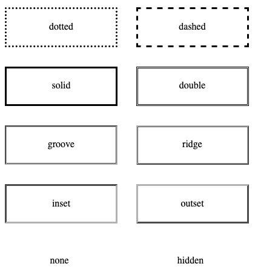

The border is a thin layer between padding and margin. Editing the border you can make elements draw their perimeter on screen.

You can work on borders by using those properties:

- `border-style`
- `border-color`
- `border-width`

The property `border` can be used as a shorthand for all those properties.

`border-radius` is used to create rounded corners.

You also have the ability to use images as borders, an ability given to you by `border-image` and its specific separate properties:

- `border-image-source`
- `border-image-slice`
- `border-image-width`
- `border-image-outset`
- `border-image-repeat`

Let's start with `border-style`.

## The border style

The `border-style` property lets you choose the style of the border. The options you can use are:

- `dotted`
* `dashed`
* `solid`
* `double`
* `groove`
* `ridge`
* `inset`
* `outset`
* `none`
* `hidden`



Check [this Codepen](https://codepen.io/flaviocopes/pen/yraaxq) for a live example

The default for the style is `none`, so to make the border appear at all you need to change it to something else. `solid` is a good choice most of the times.

You can set a different style for each edge using the properties

- `border-top-style`
- `border-right-style`
- `border-bottom-style`
- `border-left-style`

or you can use `border-style` with multiple values to define them, using the usual Top-Right-Bottom-Left order:

```css
p {
  border-style: solid dotted solid dotted;
}
```

## The border width

`border-width` is used to set the width of the border.

You can use one of the pre-defined values:

- `thin`
- `medium` (the default value)
- `thick`

or express a value in pixels, em or rem or any other valid length value.

Example:

```css
p {
  border-width: 2px;
}
```

You can set the width of each edge (Top-Right-Bottom-Left) separately by using 4 values:

```css
p {
  border-width: 2px 1px 2px 1px;
}
```

or you can use the specific edge properties `border-top-width`, `border-right-width`, `border-bottom-width`, `border-left-width`.

## The border color

`border-color` is used to set the color of the border.

If you don't set a color, the border by default is colored using the color of the text in the element.

You can pass any valid color value to `border-color`.

Example:

```css
p {
  border-color: yellow;
}
```

You can set the color of each edge (Top-Right-Bottom-Left) separately by using 4 values:

```css
p {
  border-color: black red yellow blue;
}
```

or you can use the specific edge properties `border-top-color `, `border-right-color `, `border-bottom-color `, `border-left-color `.

## The border shorthand property

Those 3 properties mentioned, `border-width`, `border-style` and `border-color` can be set using the shorthand property `border`.

Example:

```css
p {
  border: 2px black solid;
}
```

You can also use the edge-specific properties `border-top`, `border-right`, `border-bottom`, `border-left`.

Example:

```css
p {
  border-left: 2px black solid;
  border-right: 3px red dashed;
}
```

## The border radius

`border-radius` is used to set rounded corners to the border. You need to pass a value that will be used as the radius of the circle that will be used to round the border.

Usage:

```css
p {
  border-radius: 3px;
}
```


You can also use the edge-specific properties `border-top-left-radius`, `border-top-right-radius`, `border-bottom-left-radius`, `border-bottom-right-radius`.

## Using images as borders

One very cool thing with borders is the ability to use images to style them. This lets you go very creative with borders.

We have 5 properties:

- `border-image-source`
- `border-image-slice`
- `border-image-width`
- `border-image-outset`
- `border-image-repeat`

and the shorthand `border-image`. I won't go in much details here as images as borders would need a more in-depth coverage as the one I can do in this little chapter. I recommend reading the [CSS Tricks almanac entry on border-image](https://css-tricks.com/almanac/properties/b/border-image/) for more information.