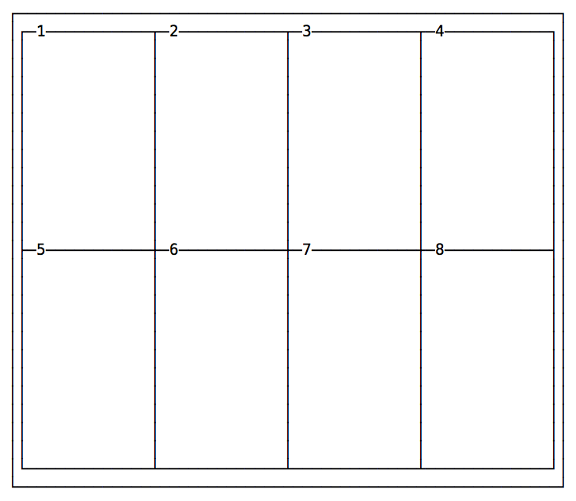
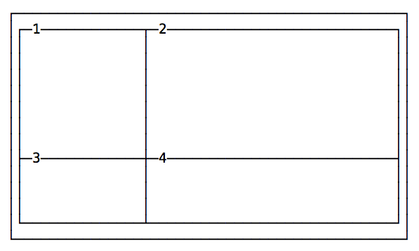
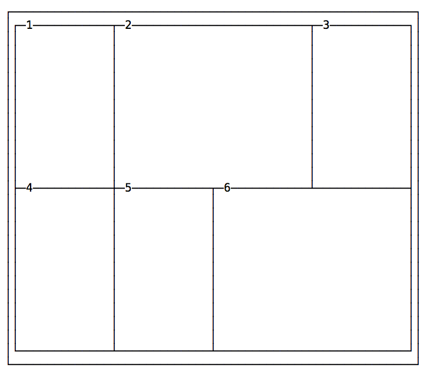

CSS Grid is the new kid in the CSS town, and while not yet fully supported by all browsers, it's going to be the future system for layouts.

CSS Grid is a fundamentally new approach to building layouts using CSS.

Keep an eye on the CSS Grid Layout page on caniuse.com (https://caniuse.com/#feat=css-grid) to find out which browsers currently support it. At the time of writing, April 2019, all major browsers (except IE, which will never have support for it) are already supporting this technology, covering 92% of all users.

CSS Grid is not a competitor to Flexbox. They interoperate and collaborate on complex layouts, because CSS Grid works on 2 dimensions (rows AND columns) while Flexbox works on a single dimension (rows OR columns).

Building layouts for the web has traditionally been a complicated topic.

I won't dig into the reasons for this complexity, which is a complex topic on its own, but you can think yourself as a very lucky human because nowadays you have 2 very powerful and well supported tools at your disposal:

- **CSS Flexbox**
- **CSS Grid**

These 2 are the tools to build the Web layouts of the future.

Unless you need to support old browsers like IE8 and IE9, there is no reason to be messing with things like:

- Table layouts
- Floats
- clearfix hacks
- `display: table` hacks

In this guide there's all you need to know about going from a zero knowledge of CSS Grid to being a proficient user.

## The basics

The CSS Grid layout is activated on a container element (which can be a `div` or any other tag) by setting `display: grid`.

As with flexbox, you can define some properties on the container, and some properties on each individual item in the grid.

These properties combined will determine the final look of the grid.

The most basic container properties are `grid-template-columns` and `grid-template-rows`.

### grid-template-columns and grid-template-rows

Those properties define the number of columns and rows in the grid, and they also set the width of each column/row.

The following snippet defines a grid with 4 columns each 200px wide, and 2 rows with a 300px height each.

```css
.container {
  display: grid;
  grid-template-columns: 200px 200px 200px 200px;
  grid-template-rows: 300px 300px;
}
```



Here's another example of a grid with 2 columns and 2 rows:

```css
.container {
  display: grid;
  grid-template-columns: 200px 200px;
  grid-template-rows: 100px 100px;
}
```


### Automatic dimensions

Many times you might have a fixed header size, a fixed footer size, and the main content that is flexible in height, depending on its length. In this case you can use the `auto` keyword:


```css
.container {
  display: grid;
  grid-template-rows: 100px auto 100px;
}
```

### Different columns and rows dimensions

In the above examples we made regular grids by using the same values for rows and the same values for columns.

You can specify any value for each row/column, to create a lot of different designs:

```css
.container {
  display: grid;
  grid-template-columns: 100px 200px;
  grid-template-rows: 100px 50px;
}
```



Another example:

```css
.container {
  display: grid;
  grid-template-columns: 10px 100px;
  grid-template-rows: 100px 10px;
}
```


### Adding space between the cells

Unless specified, there is no space between the cells.

You can add spacing by using those properties:
- `grid-column-gap`
- `grid-row-gap`

or the shorthand syntax `grid-gap`.

Example:

```css
.container {
  display: grid;
  grid-template-columns: 100px 200px;
  grid-template-rows: 100px 50px;
  grid-column-gap: 25px;
  grid-row-gap: 25px;
}
```


The same layout using the shorthand:

```css
.container {
  display: grid;
  grid-template-columns: 100px 200px;
  grid-template-rows: 100px 50px;
  grid-gap: 25px;
}
```

### Spawning items on multiple columns and/or rows

Every cell item has the option to occupy more than just one box in the row, and expand horizontally or vertically to get more space, while respecting the grid proportions set in the container.

Those are the properties we'll use for that:
- `grid-column-start`
- `grid-column-end`
- `grid-row-start`
- `grid-row-end`

Example:

```css
.container {
  display: grid;
  grid-template-columns: 200px 200px 200px 200px;
  grid-template-rows: 300px 300px;
}
.item1 {
  grid-column-start: 2;
  grid-column-end: 4;
}
.item6 {
  grid-column-start: 3;
  grid-column-end: 5;
}
```



The numbers correspond to the vertical line that separates each column, starting from 1:


The same principle applies to `grid-row-start` and `grid-row-end`, except this time instead of taking more columns, a cell takes more rows.

#### Shorthand syntax

Those properties have a shorthand syntax provided by:
- `grid-column`
- `grid-row`

The usage is simple, here's how to replicate the above layout:

```css
.container {
  display: grid;
  grid-template-columns: 200px 200px 200px 200px;
  grid-template-rows: 300px 300px;
}
.item1 {
  grid-column: 2 / 4;
}
.item6 {
  grid-column: 3 / 5;
}
```

Another approach is to set the starting column/row, and set how many it should occupy using `span`:

```css
.container {
  display: grid;
  grid-template-columns: 200px 200px 200px 200px;
  grid-template-rows: 300px 300px;
}
.item1 {
  grid-column: 2 / span 2;
}
.item6 {
  grid-column: 3 / span 2;
}
```

## More grid configuration

### Using fractions

Specifying the exact width of each column or row is not ideal in every case.

A fraction is a unit of space.

The following example divides a grid into 3 columns with the same width, 1/3 of the available space each.

```css
.container {
  grid-template-columns: 1fr 1fr 1fr;
}
```

### Using percentages and rem

You can also use percentages, and mix and match fractions, pixels, rem and percentages:

```css
.container {
  grid-template-columns: 3rem 15% 1fr 2fr
}
```


### Using `repeat()`

`repeat()` is a special function that takes a number that indicates the number of times a row/column will be repeated, and the length of each one.

If every column has the same width you can specify the layout using this syntax:

```css
.container {
  grid-template-columns: repeat(4, 100px);
}
```

This creates 4 columns with the same width.

Or using fractions:

```css
.container {
  grid-template-columns: repeat(4, 1fr);
}
```

### Specify a minimum width for a row

Common use case: Have a sidebar that never collapses more than a certain amount of pixels when you resize the window.

Here's an example where the sidebar takes 1/4 of the screen and never takes less than 200px:

```css
.container {
  grid-template-columns: minmax(200px, 3fr) 9fr;
}
```

You can also set just a maximum value using the `auto` keyword:

```css
.container {
  grid-template-columns: minmax(auto, 50%) 9fr;
}
```

or just a minimum value:

```css
.container {
  grid-template-columns: minmax(100px, auto) 9fr;
}
```

### Positioning elements using `grid-template-areas`

By default elements are positioned in the grid using their order in the HTML structure.

Using `grid-template-areas` You can define template areas to move them around in the grid, and also to spawn an item on multiple rows / columns instead of using `grid-column`.

Here's an example:

```html
<div class="container">
  <main>
    ...
  </main>
  <aside>
    ...
  </aside>
  <header>
    ...
  </header>
  <footer>
    ...
  </footer>
</div>
```

```css
.container {
  display: grid;
  grid-template-columns: 200px 200px 200px 200px;
  grid-template-rows: 300px 300px;
  grid-template-areas:
    "header header header header"
    "sidebar main main main"
    "footer footer footer footer";
}
main {
  grid-area: main;
}
aside {
  grid-area: sidebar;
}
header {
  grid-area: header;
}
footer {
  grid-area: footer;
}
```

Despite their original order, items are placed where `grid-template-areas` define, depending on the `grid-area` property associated to them.

#### Adding empty cells in template areas

You can set an empty cell using the dot `.` instead of an area name in `grid-template-areas`:

```css
.container {
  display: grid;
  grid-template-columns: 200px 200px 200px 200px;
  grid-template-rows: 300px 300px;
  grid-template-areas:
    ". header header ."
    "sidebar . main main"
    ". footer footer .";
}
```

## Fill a page with a grid

You can make a grid extend to fill the page using `fr`:

```css
.container {
  display: grid;
  height: 100vh;
  grid-template-columns: 1fr 1fr 1fr 1fr;
  grid-template-rows: 1fr 1fr;
}
```

## An example: header, sidebar, content and footer

Here is a simple example of using CSS Grid to create a site layout that provides a header op top, a main part with sidebar on the left and content on the right, and a footer afterwards.


Here's the markup:

```html
<div class="wrapper">
  <header>Header</header>
  <article>
    <h1>Welcome</h1>
    <p>Hi!</p>
  </article>
  <aside><ul><li>Sidebar</li></ul></aside>
  <footer>Footer</footer>
</div>
```

and here's the CSS:

```css
header {
  grid-area: header;
  background-color: #fed330;
  padding: 20px;
}
article {
  grid-area: content;
  background-color: #20bf6b;
  padding: 20px;
}
aside {
  grid-area: sidebar;
  background-color: #45aaf2;
}
footer {
  padding: 20px;
  grid-area: footer;
  background-color: #fd9644;
}
.wrapper {
  display: grid;
  grid-gap: 20px;
  grid-template-columns: 1fr 3fr;
  grid-template-areas:
    "header  header"
    "sidebar content"
    "footer  footer";
}
```

I added some colors to make it prettier, but basically it assigns to every different tag a `grid-area` name, which is used in the `grid-template-areas` property in `.wrapper`.

When the layout is smaller we can put the sidebar below the content using a media query:

```css
@media (max-width: 500px) {
  .wrapper {
    grid-template-columns: 4fr;
    grid-template-areas:
      "header"
      "content"
      "sidebar"
      "footer";
  }
}
```

[See on CodePen](https://codepen.io/flaviocopes/pen/JZWOEK)

## Wrapping up

These are the basics of CSS Grid. There are many things I didn't include in this introduction but I wanted to make it very simple, to start using this new layout system without making it feel overwhelming.

