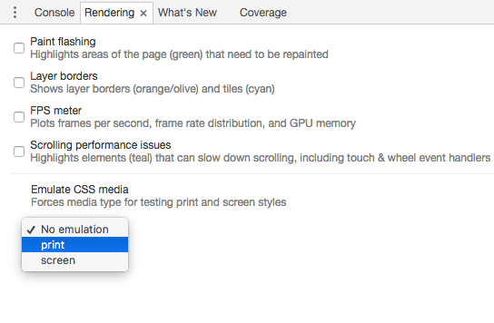

Even though we increasingly stare at our screens, printing is still a thing.

Even with blog posts. I remember one time back in 2009 I met a person that told me he made his personal assistant print every blog post I published (yes, I stared blankly for a little bit). Definitely unexpected.

My main use case for looking into printing usually is printing to a PDF. I might create something inside the browser, and I want to make it available as PDF.

Browsers make this very easy, with Chrome defaulting to "Save" when trying to print a document and a printer is not available, and Safari has a dedicated button in the menu bar:


## Print CSS

Some common things you might want to do when printing is to hide some parts of the document, maybe the footer, something in the header, the sidebar.

Maybe you want to use a different font for printing, which is totally legit.

If you have a large CSS for print, you'd better use a separate file for it. Browsers will only download it when printing:

```html
<link rel="stylesheet"
      src="print.css"
      type="text/css"
      media="print" />
```

## CSS @media print

An alternative to the previous approach is media queries. Anything you add inside this block:

```css
@media print {
  /* ... */
}
```

is going to be applied only to printed documents.


## Links

HTML is great because of links. It's called HyperText for a good reason. When printing we might lose a lot of information, depending on the content.

CSS offers a great way to solve this problem by editing the content, appending the link after the `<a>` tag text, using:

```css
@media print {
    a[href*='//']:after {
        content:" (" attr(href) ") ";
        color: $primary;
    }
}
```

I target `a[href*='//']` to only do this for external links. I might have internal links for navigation and internal indexing purposes, which would be useless in most of my use cases. If you also want internal links to be printed, just do:

```css
@media print {
    a:after {
        content:" (" attr(href) ") ";
        color: $primary;
    }
}
```

## Page margins

You can add margins to every single page. `cm` or `in` is a good unit for paper printing.

```css
@page {
    margin-top: 2cm;
    margin-bottom: 2cm;
    margin-left: 2cm;
    margin-right: 2cm;
}
```

`@page` can also be used to only target the first page, using `@page :first`, or only the left and right pages using `@page :left` and `@page: right`.

## Page breaks

You might want to add a page break after some elements, or before them. Use `page-break-after` and `page-break-before`:

```css
.book-date {
    page-break-after: always;
}

.post-content {
    page-break-before: always;
}
```

Those properties [accept a wide variety of values](https://developer.mozilla.org/en-US/docs/Web/CSS/page-break-after).

## Avoid breaking images in the middle

I experienced this with Firefox: images by default are cut in the middle, and continue on the next page. It might also happen to text.

Use

```css
p {
  page-break-inside: avoid;
}
```

and wrap your images in a `p` tag. Targeting `img` directly didn't work in my tests.

This applies to other content as well, not just images. If you notice something is cut when you don't want, use this property.

## Debug the printing presentation

The Chrome DevTools offer ways to emulate the print layout:


Once the panel opens, change the rendering emulation to `print`:

