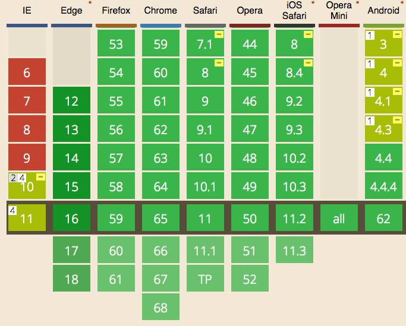
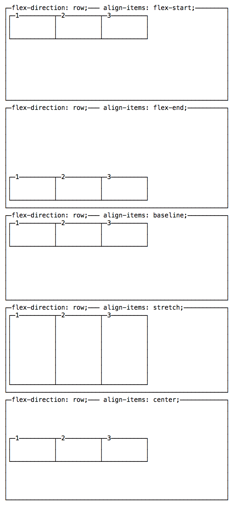

Flexbox, also called Flexible Box Module, is one of the two modern layouts systems, along with CSS Grid.

Compared to CSS Grid (which is bi-dimensional), flexbox is a **one-dimensional layout model**. It will control the layout based on a row or on a column, but not together at the same time.

The main goal of flexbox is to allow items to fill the whole space offered by their container, depending on some rules you set.

Unless you need to support old browsers like IE8 and IE9, Flexbox is the tool that lets you forget about using

- Table layouts
- Floats
- clearfix hacks
- `display: table` hacks

Let's dive into flexbox and become a master of it in a very short time.

## Browser support

At the time of writing (Feb 2018), it's supported by 97.66% of the users, all the most important browsers implement it since years, so even older browsers (including IE10+) are covered:



While we must wait a few years for users to catch up on CSS Grid, Flexbox is an older technology and can be used right now.

## Enable Flexbox

A flexbox layout is applied to a container, by setting

```css
display: flex;
```

 or

```css
display: inline-flex;
```

the content **inside the container** will be aligned using flexbox.

- - - -

## Container properties

Some flexbox properties apply to the container, which sets the general rules for its items. They are

- `flex-direction`
- `justify-content`
- `align-items`
- `flex-wrap`
- `flex-flow`

### Align rows or columns

The first property we see, **`flex-direction`**, determines if the container should align its items as rows, or as columns:

- `flex-direction: row` places items as a **row**, in the text direction (left-to-right for western countries)
- `flex-direction: row-reverse` places items just like `row` but in the opposite direction
- `flex-direction: column` places items in a **column**, ordering top to bottom
- `flex-direction: column-reverse` places items in a column, just like `column` but in the opposite direction
-


### Vertical and horizontal alignment

By default items start from the left if `flex-direction` is row, and from the top if `flex-direction` is column.


You can change this behavior using `justify-content` to change the horizontal alignment, and `align-items` to change the vertical alignment.

#### Change the horizontal alignment

**`justify-content`** has 5 possible values:

- `flex-start`: align to the left side of the container.
- `flex-end`: align to the right side of the container.
- `center`: align at the center of the container.
- `space-between`: display with equal spacing between them.
- `space-around`: display with equal spacing around them


#### Change the vertical alignment

**`align-items`** has 5 possible values:

- `flex-start`: align to the top of the container.
- `flex-end`: align to the bottom of the container.
- `center`: align at the vertical center of the container.
- `baseline`: display at the baseline of the container.
- `stretch`: items are stretched to fit the container.



##### A note on `baseline`

`baseline` looks similar to `flex-start` in this example, due to my boxes being too simple. Check out [this Codepen](https://codepen.io/flaviocopes/pen/oExoJR) to have a more useful example, which I forked from a Pen originally created by [Martin Michálek](https://twitter.com/machal). As you can see there, items dimensions are aligned.

### Wrap

By default items in a flexbox container are kept on a single line, shrinking them to fit in the container.

To force the items to spread across multiple lines, use `flex-wrap: wrap`. This will distribute the items according to the order set in `flex-direction`. Use `flex-wrap: wrap-reverse` to reverse this order.

A shorthand property called `flex-flow` allows you to specify `flex-direction` and `flex-wrap` in a single line, by adding the `flex-direction` value first, followed by `flex-wrap` value, for example: `flex-flow: row wrap`.

- - - -

## Properties that apply to each single item

Since now, we've seen the properties you can apply to the container.

Single items can have a certain amount of independence and flexibility, and you can alter their appearance using those properties:

- `order`
- `align-self`
- `flex-grow`
- `flex-shrink`
- `flex-basis`
- `flex`

Let's see them in detail.

### Moving items before / after another one using order

Items are ordered based on a order they are assigned. By default every item has order `0` and the appearance in the HTML determines the final order.

You can override this property using `order` on each separate item. This is a property you set on the item, not the container. You can make an item appear before all the others by setting a negative value.


### Vertical alignment using align-self

An item can choose to **override** the container `align-items` setting, using **`align-self`**, which has the same 5 possible values of `align-items`:

- `flex-start`: align to the top of the container.
- `flex-end`: align to the bottom of the container.
- `center`: align at the vertical center of the container.
- `baseline`: display at the baseline of the container.
- `stretch`: items are stretched to fit the container.


### Grow or shrink an item if necessary

##### flex-grow

The defaut for any item is 0.

If all items are defined as 1 and one is defined as 2, the bigger element will take the space of two "1" items.

##### flex-shrink

The defaut for any item is 1.

If all items are defined as 1 and one is defined as 3, the bigger element will shrink 3x the other ones. When less space is available, it will take 3x less space.

##### flex-basis

If set to `auto`, it sizes an item according to its width or height, and adds extra space based on the `flex-grow` property.

If set to 0, it does not add any extra space for the item when calculating the layout.

If you specify a pixel number value, it will use that as the length value (width or height depends if it's a row or a column item)

##### flex

This property combines the above 3 properties:

- `flex-grow`
- `flex-shrink`
- `flex-basis`

and provides a shorthand syntax: `flex: 0 1 auto`


