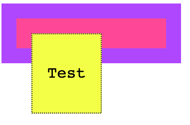
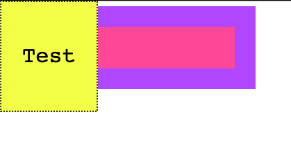
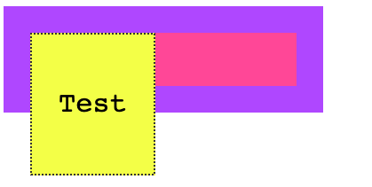
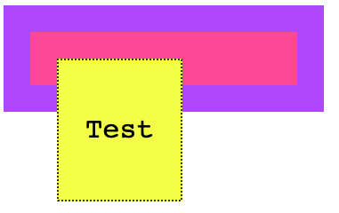
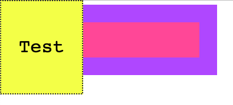

Positioning is what makes us determine where elements appear on the screen, and how they appear.

You can move elements around, and position them exactly where you want.

In this section we'll also see how things change on a page based on how elements with different `position` interact with each other.

We have one main CSS property: `position`.

It can have those 5 values:

- `static`
- `relative`
- `absolute`
- `fixed`
- `sticky`

## Static positioning

This is the default value for an element. Static positioned elements are displayed in the normal page flow.

## Relative positioning

If you set `position: relative` on an element, you are now able to position it with an offset, using the properties

- top
- right
- bottom
- left

which are called **offset properties**. They accept a length value or a percentage.

Take [this example I made on Codepen](https://codepen.io/flaviocopes/pen/WWGgrR). I create a parent container, a child container, and an inner box with some text:

```html
<div class="parent">
  <div class="child">
    <div class="box">
      <p>Test</p>
    </div>
  </div>
</div>
```

with some CSS to give some colors and padding, but does not affect positioning:

```css
.parent {
  background-color: #af47ff;
  padding: 30px;
  width: 300px;
}

.child {
  background-color: #ff4797;
  padding: 30px;
}

.box {
  background-color: #f3ff47;
  padding: 30px;
  border: 2px solid #333;
  border-style: dotted;
  font-family: courier;
  text-align: center;
  font-size: 2rem;
}
```

here's the result:


You can try and add any of the properties I mentioned before (`top`, `right`, `bottom`, `left`) to `.box`, and nothing will happen. The position is `static`.

Now if we set `position: relative` to the box, at first  apparently nothing changes. But the element is now able to move using the `top`, `right`, `bottom`, `left` properties, and now you can alter the position of it relatively to the element containing it.

For example:

```
.box {
  /* ... */
  position: relative;
  top: -60px;
}
```


A negative value for `top` will make the box move up relatively to its container.

Or

```
.box {
  /* ... */
  position: relative;
  top: -60px;
  left: 180px;
}
```


Notice how the space that is occupied by the box remains preserved in the container, like it was still in its place.

Another property that will now work is `z-index` to alter the z-axis placement. We'll talk about it later on.

## Absolute positioning

Setting `position: absolute` on an element will remove it from the document's flow, and it will not longer .

Remember in relative positioning that we noticed the space originally occupied by an element was preserved even if it was moved around?

With absolute positioning, as soon as we set `position: absolute` on `.box`, its original space is now collapsed, and only the origin (x, y coordinates) remain the same.

```
.box {
  /* ... */
  position: absolute;
}
```



We can now move the box around as we please, using the `top`, `right`, `bottom`, `left` properties:

```
.box {
  /* ... */
  position: absolute;
  top: 0px;
  left: 0px;
}
```



or

```
.box {
  /* ... */
  position: absolute;
  top: 140px;
  left: 50px;
}
```


The coordinates are relative to the closest container that is not `static`.

This means that if we add `position: relative` to the `.child` element, and we set `top` and `left` to 0, the box will not be positioned at the top left margin of the *window*, but rather it will be positioned at the 0, 0 coordinates of `.child`:

```
.child {
  /* ... */
  position: relative;
}

.box {
  /* ... */
  position: absolute;
  top: 0px;
  left: 0px;
}
```



Here's (how we already saw) of `.child` is static (the default):

```
.child {
  /* ... */
  position: static;
}

.box {
  /* ... */
  position: absolute;
  top: 0px;
  left: 0px;
}
```


Like for relative positioning, you can use `z-index` to alter the z-axis placement.

## Fixed positioning

Like with absolute positioning, when an element is assigned `position: fixed` it's removed from the flow of the page.

The difference with absolute positioning is this: elements are now always positioned relative to the window, instead of the first non-static container.

```
.box {
  /* ... */
  position: fixed;
}
```




```
.box {
  /* ... */
  position: fixed;
  top: 0;
  left: 0;
}
```



Another big difference is that elements are not affected by scrolling. Once you put a sticky element somewhere, scrolling the page does not remove it from the visible part of the page.

## Sticky positioning

While the above values have been around for a very long time, this one was introduced recently and it's still relatively unsupported ([see caniuse.com](https://caniuse.com/#feat=css-sticky))

The UITableView iOS component is the thing that comes to mind when I think about `position: sticky`. You know when you scroll in the contacts list and the first letter is sticked to the top, to let you know you are viewing that particular letter's contacts?

We used JavaScript to emulate that, but this is the approach taken by CSS to allow it natively.

