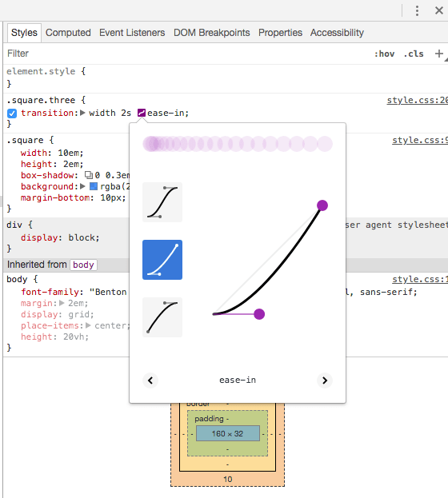

CSS Transitions are the most simple way to create an animation in CSS.

In a transition, you change the value of a property, and you tell CSS to slowly change it according to some parameters, towards a final state.

CSS Transitions are defined by these properties:

Property|Description
--------|------
`transition-property`| the CSS property that should transition
`transition-duration`| the duration of the transition
`transition-timing-function`| the timing function used by the animation (common values: linear, ease). Default: ease
`transition-delay`| optional number of seconds to wait before starting the animation


The `transition` property is a handy shorthand:

```css
.container {
  transition: property
              duration
              timing-function
              delay;
}
```

## Example of a CSS Transition

This code implements a CSS Transition:

```css
.one,
.three {
  background: rgba(142, 92, 205, .75);
  transition: background 1s ease-in;
}

.two,
.four {
  background: rgba(236, 252, 100, .75);
}

.circle:hover {
  background: rgba(142, 92, 205, .25); /* lighter */
}
```

See the example on Glitch
<https://flavio-css-transitions-example.glitch.me>

When hovering the `.one` and `.three` elements, the purple circles, there is a transition animation that ease the change of background, while the yellow circles do not, because they do not have the `transition` property defined.

## Transition timing function values

`transition-timing-function` allows to specify the acceleration curve of the transition.

There are some simple values you can use:

- `linear`
- `ease`
- `ease-in`
- `ease-out`
- `ease-in-out`

[This Glitch](https://flavio-css-transitions-easings.glitch.me) shows how those work in practice.

You can create a completely custom timing function using [cubic bezier curves](https://developer.mozilla.org/en-US/docs/Web/CSS/single-transition-timing-function). This is rather advanced, but basically any of those functions above is built using bezier curves. We have handy names as they are common ones.

## CSS Transitions in Browser DevTools

The [Browser DevTools](https://flaviocopes.com/browser-devtools/) offer a great way to visualize transitions.

This is Chrome:



This is Firefox:


From those panels you can live edit the transition and experiment in the page directly without reloading your code.

## Which Properties you can Animate using CSS Animations

A lot! They are the same you can animate using CSS Transitions, too.

Here's the full list:

- `background`
- `background-color`
- `background-position`
- `background-size`
- `border`
- `border-color`
- `border-width`
- `border-bottom`
- `border-bottom-color`
- `border-bottom-left-radius`
- `border-bottom-right-radius`
- `border-bottom-width`
- `border-left`
- `border-left-color`
- `border-left-width`
- `border-radius`
- `border-right`
- `border-right-color`
- `border-right-width`
- `border-spacing`
- `border-top`
- `border-top-color`
- `border-top-left-radius`
- `border-top-right-radius`
- `border-top-width`
- `bottom`
- `box-shadow`
- `caret-color`
- `clip`
- `color`
- `column-count`
- `column-gap`
- `column-rule`
- `column-rule-color`
- `column-rule-width`
- `column-width`
- `columns`
- `content`
- `filter`
- `flex`
- `flex-basis`
- `flex-grow`
- `flex-shrink`
- `font`
- `font-size`
- `font-size-adjust`
- `font-stretch`
- `font-weight`
- `grid-area`
- `grid-auto-columns`
- `grid-auto-flow`
- `grid-auto-rows`
- `grid-column-end`
- `grid-column-gap`
- `grid-column-start`
- `grid-column`
- `grid-gap`
- `grid-row-end`
- `grid-row-gap`
- `grid-row-start`
- `grid-row`
- `grid-template-areas`
- `grid-template-columns`
- `grid-template-rows`
- `grid-template`
- `grid`
- `height`
- `left`
- `letter-spacing`
- `line-height`
- `margin`
- `margin-bottom`
- `margin-left`
- `margin-right`
- `margin-top`
- `max-height`
- `max-width`
- `min-height`
- `min-width`
- `opacity`
- `order`
- `outline`
- `outline-color`
- `outline-offset`
- `outline-width`
- `padding`
- `padding-bottom`
- `padding-left`
- `padding-right`
- `padding-top`
- `perspective`
- `perspective-origin`
- `quotes`
- `right`
- `tab-size`
- `text-decoration`
- `text-decoration-color`
- `text-indent`
- `text-shadow`
- `top`
- `transform.`
- `vertical-align`
- `visibility`
- `width`
- `word-spacing`
- `z-index`